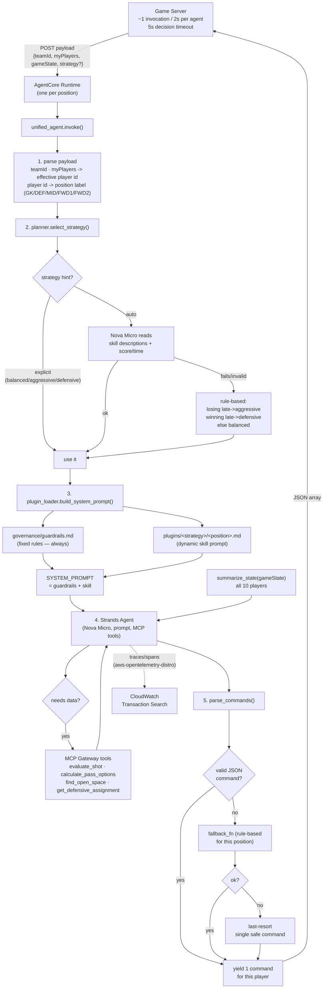

# Per-Tick Agent Workflow

What happens on every game tick, for every one of the 5 agents. The game server
invokes each agent independently (~1 call / 2s, 5s timeout).

```mermaid
flowchart TD
    GS["Game Server<br/>~1 invocation / 2s per agent<br/>5s decision timeout"] -->|"POST payload<br/>{teamId, myPlayers, gameState, strategy?}"| RT["AgentCore Runtime<br/>(one per position)"]

    RT --> INV["unified_agent.invoke()"]

    INV --> P1["1. parse payload<br/>teamId · myPlayers -> effective player id<br/>player id -> position label (GK/DEF/MID/FWD1/FWD2)"]

    P1 --> PLAN["2. planner.select_strategy()"]
    PLAN --> PLANQ{"strategy hint?"}
    PLANQ -->|"explicit<br/>(balanced/aggressive/defensive)"| USE["use it"]
    PLANQ -->|"auto"| LLM1["Nova Micro reads<br/>skill descriptions + score/time"]
    LLM1 -->|ok| USE
    LLM1 -->|"fails/invalid"| RULE["rule-based:<br/>losing late->aggressive<br/>winning late->defensive<br/>else balanced"]
    RULE --> USE

    USE --> BUILD["3. plugin_loader.build_system_prompt()"]
    BUILD --> G["governance/guardrails.md<br/>(fixed rules — always)"]
    BUILD --> SK["plugins/&lt;strategy&gt;/&lt;position&gt;.md<br/>(dynamic skill prompt)"]
    G --> PROMPT["SYSTEM_PROMPT<br/>= guardrails + skill"]
    SK --> PROMPT

    PROMPT --> AGENT["4. Strands Agent<br/>(Nova Micro, prompt, MCP tools)"]
    STATE["summarize_state(gameState)<br/>all 10 players"] --> AGENT

    AGENT --> TOOLS{"needs data?"}
    TOOLS -->|yes| MCP["MCP Gateway tools<br/>evaluate_shot · calculate_pass_options<br/>find_open_space · get_defensive_assignment"]
    MCP --> AGENT

    AGENT --> PARSE["5. parse_commands()"]
    PARSE --> OK{"valid JSON<br/>command?"}
    OK -->|yes| OUT["yield 1 command<br/>for this player"]
    OK -->|no| FB["fallback_fn (rule-based<br/>for this position)"]
    FB --> FBOK{"ok?"}
    FBOK -->|yes| OUT
    FBOK -->|no| LR["last-resort<br/>single safe command"]
    LR --> OUT

    OUT -->|"JSON array"| GS
    AGENT -.->|"traces/spans<br/>(aws-opentelemetry-distro)"| CW["CloudWatch<br/>Transaction Search"]
```
